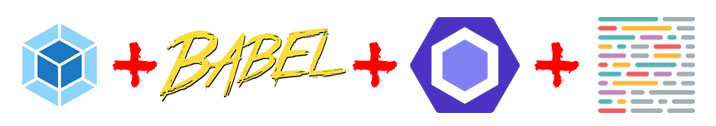

# node-console-app-boilerplate



Project skeleton ready to development of node.js console application.

# Useful packages
```
npm install chalk
``` 

* [chalk](https://github.com/chalk/chalk) - terminal string styling
